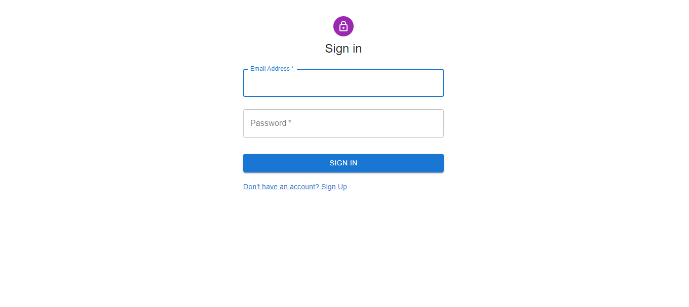
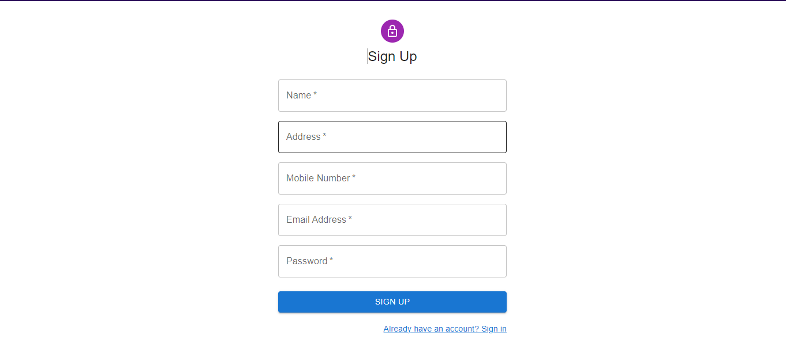

# Online Driving Assessment and Licensing Exam | Full Stack Web App | ReactJS

## Live Link - https://odals.vercel.app

## Demo Link - https://youtu.be/s74KGbOHtb8

## Stack Used - React, Material UI, Recoil, html-to-image, downloadJS

## Steps to Run Locally:

- on main directory, run `npm install`
- then, run `npm run dev`

## Challenges Faced:

- Writing Custom CSS for MUI Option Buttons on Exam Page and Synching them with Non-Selected/Selected/Correct/Wrong Options.

## Learnable Part of the Project:

- Implementing Download and Printing Features on Provided Components.

## Views

### Sign In Page

### Sign Up Page

### User Credentials Validation From Backend

### Home Page

### Profile Page

### Password Changing Validations

### The Exam Page with Timer and Progress bar

### Eye-Catching Indications of Correct/Wrong Ansers

### Preventing User from Exiting the Exam Page until Completed

### Exam Failed

### Exam Passed

### Printable and Downloadable License Card

### Recording User Actions

### License Card (PNG)

### Unauthorized Access Page (Tracking User Login and Logout Sessions by using Browser's Local Storage)

### User Schema on DB

